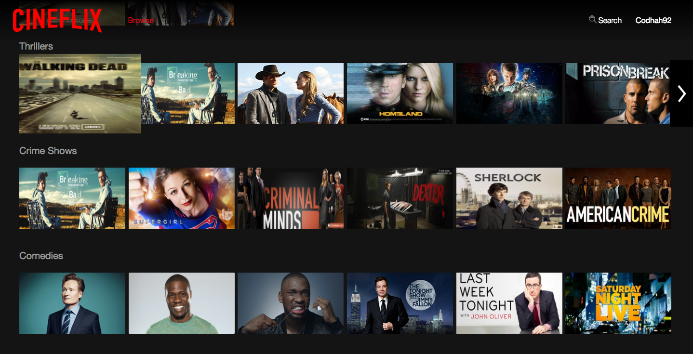
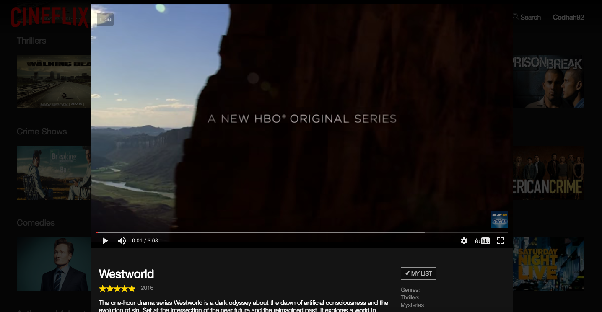
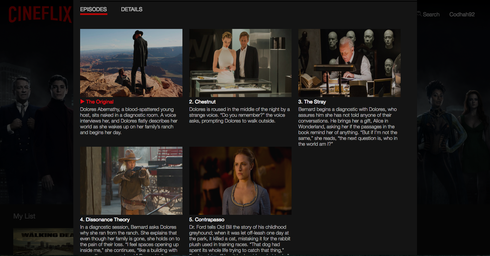
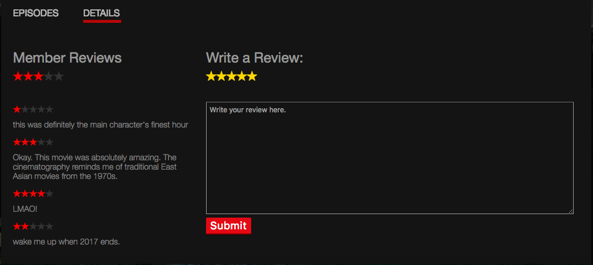
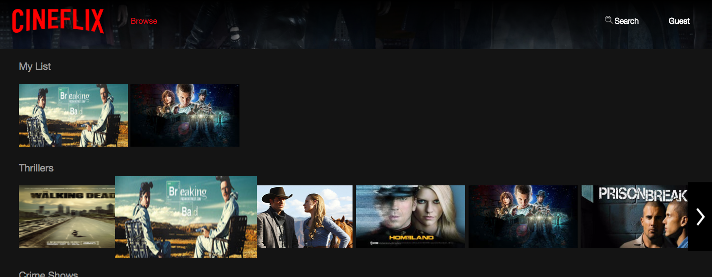
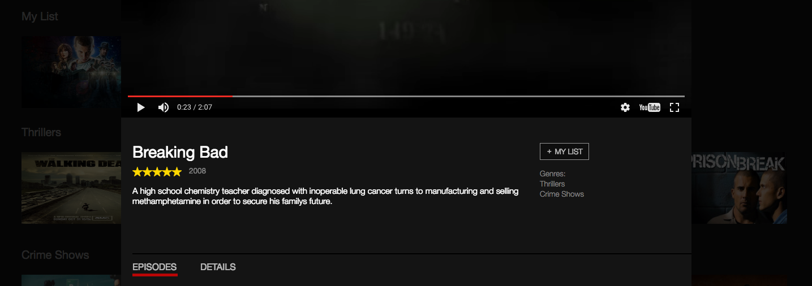
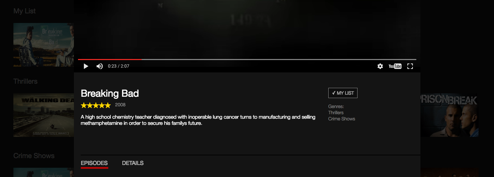
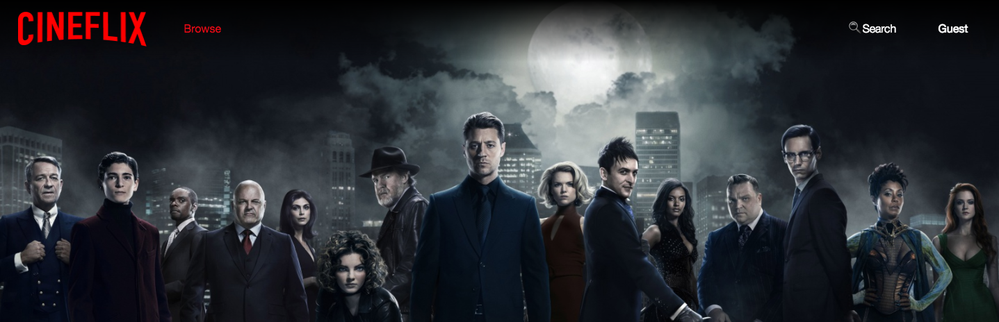
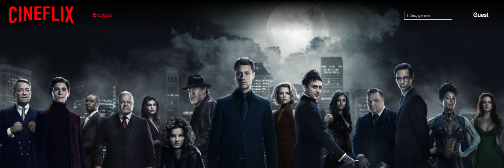
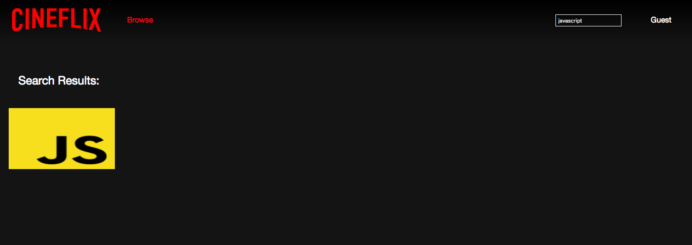

# CineFlix

[CineFlix live][heroku]

[heroku]: http://cineflixx.herokuapp.com/

## Description

CineFlix is a full-stack web application inspired by Netflix. It is built
on a backend of Ruby on Rails and PostgreSQL. The frontend is implemented
with Javascript, React.js and a Redux architectural framework.

## Browse
The browse page is the main page of Cineflix. It displays all genres of movies and TV shows that a user can view. When a user is logged in, clicking on the Cineflix logo will route the user back to the browse page.



## Videos
Videos are retrieved from a YouTube API. The react-youtube library is used
to play videos of each `Episode` through its `video_url`.Episodes are listed
as an array inside of a `Serie` object and `Serie` objects are held within a
series array within each `Genre`. When a user logs in
to CineFlix, the user is directed to the /browse page of his or her personal
video listing and is able to view every genre that holds `Serie` objects. The user
can then access a series' episodes by clicking into any of these `Serie` objects.

``` javascript
import YouTube from 'react-youtube';

const VideoPlayer = (props) => {
  const opts = {
    height: '100%',
    width: '100%',
    position: 'absolute',
    top: 0,
    left: 0,
    playerVars: {
      autohide: 1,
      showinfo: 0,
      autoplay: 1,
      controls: 2,
      modestBranding: 1
    }
  };

  return (
    <YouTube
      videoId={props.videoId}
      opts={opts}
    />
  );
}
```

## Series
When a `Serie` object is clicked in the browse page, a modal is rendered on the
screen, autoplaying the first episode of the current series. The modal also
dims the background, allowing for a more cinema-like experience for the user. The modal also provides the description, average rating, year, genres and `My List` button.



## Episodes
Episodes of a series are displayed inside of the series modal. The current episode that is playing has its title highlighted in red with a play button next to it. The titles of other episodes in the series are numbered and displayed in white.



## Reviews and Ratings
Ratings are stored within each series. Each `Serie` object holds an
`avg_rating`, which is calculated through a SQL query that finds the average
of every rating of that serie by all users in the database. Average user ratings
are displayed initially in red. When a user rates a serie, their rating will be
rendered in gold and will persist. Ratings are created and updated both in the
frontend and backend to allow for a dynamic experience for the user.

Users can also write reviews in the Details section of each  series.



If the review is submitted, the `Submit` button will change to an `Edit`, indicating that it is saved. The current user's review will be displayed with smaller gold stars, and will appear at the top of the `Member Reviews` section.


## My List
A `My List` button is available on each serie modal. Every user has his or her
own personal `My List`, which keeps track of the user's favorited shows.



Initially,
all items are listed with a plus sign in front to indicate that they can be added to
the user's `My List`.




Once the series is added to a `My List`, the plus sign becomes a
check mark.



The button can be clicked again to remove the series from a user's `My List`.
`My List` was implemented with a Favorites table, which acts as a join table for
users and series.


## Image Carousel (Wrap-around Infinite Scroll)
The image carousel is displayed for each genre on the '/browse' page whenever the
row contains 6 or more series. The scroll was created using a react library called
react-slick. The scroll slides 6 series at a time until it reaches the last few series
within the genre as demonstrated by the following code snippet:

``` javascript
  import Slider from 'react-slick';

  const settings = {
    slidesToShow: 6,
    slidesToScroll: 6,
    infinite: true
  };
```


## Search
A search bar is available for users to dynamically search for the titles of series.



On click, the search bar will open for the user to search for a series title.



When a user begins to input a title in the search bar of the browse page, the page will
redirect to a Search page, through which the user can then begin to find the title of their choice.
The search page provides users with access to all videos that they'd like to watch and
also allows users to add videos to their `My List`.



## Future Directions for the Project
Additional features to implement for Cineflix include:
- [ ] Continue Watching for series that user is currently watching
- [ ] Notifications for new series
- [ ] OAuth
- [ ] Infinite Scroll
- [ ] Autoplaying episodes immediately after the end of a previous episode in a series
